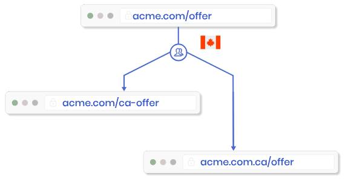

# netlify-redirect-by-geoip
POC about using Netlify redirect by GeoIP

## Proposal

This POC try to solve a business problem using Netlify and GeoIP redirection

## Requirements

**Scenarios**

- 1

`Given` the user is from Mexico 

`When` to access [geoip-redirection-dev.netlify.app](http://geoip-redirection-dev.netlify.app)

`Then` it will be redirected to [geoip-redirection-dev.netlify.app/mx](http://geoip-redirection-dev.netlify.app/mx)

- 2

`Given` the user is from Spain 

`When` to access geoip-redirection-dev.netlify.app

`Then` it will be redirected to [geoip-redirection-dev.netlify.app/mx](http://geoip-redirection-dev.netlify.app/mx) 

## Netlify

The Netlify can use redirect by language or Country

Link about [Redirect by Country or Language](https://docs.netlify.com/routing/redirects/redirect-options/#redirect-by-country-or-language)
